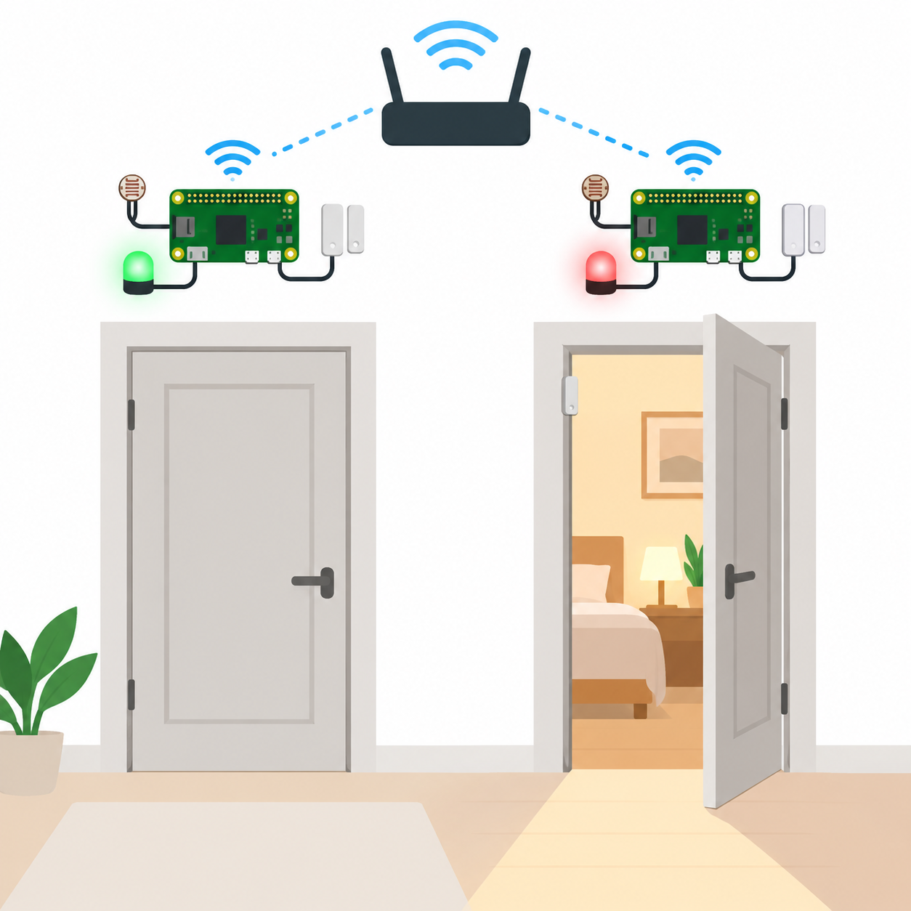
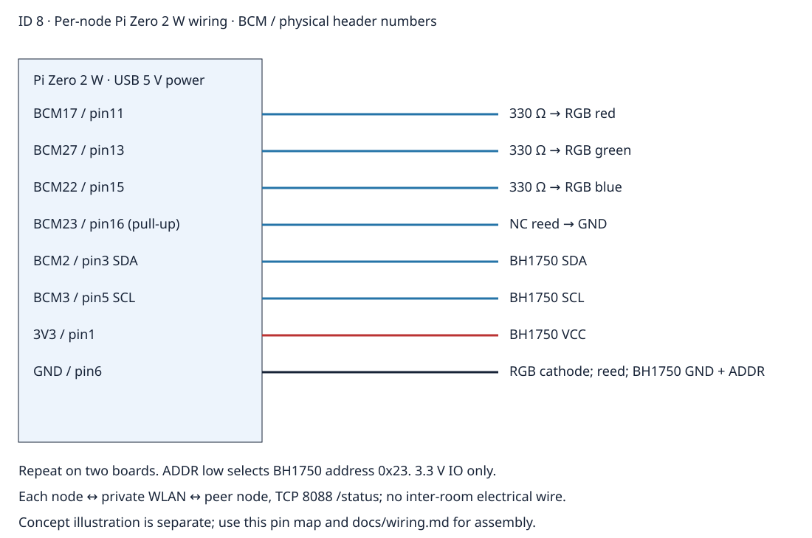

# Room Climate Hub Multi-Room Network
Roadmap ID 8 — two Raspberry Pi Zero 2 W room nodes coordinate LED status over a private local Wi-Fi network, using real door and light sensor interfaces.



## Overview, objectives and features
Build a repeatable two-room prototype: each node reads a magnetic door contact and BH1750 light sensor, serves JSON locally, polls its peer and sets RGB status from both rooms. Learn network record validation, replay handling and stale-peer detection. Red means missing peer; blue means any fresh room has an open door below 50 lux; green means neither condition applies.

## Architecture and platform
Pi Zero 2 W running Raspberry Pi OS with Python 3.12-compatible source. GPIOZero controls three LED channels and a pull-up reed input; SMBus2 reads BH1750 over I2C1. TCP8088 /status exports the local record. Peer polling has a 0.5-second timeout and 2048-byte response limit. Records expire after five seconds. A rebooted sequence is accepted once the old record expires. Networking is local-only; internet access is unnecessary during operation.

## BOM quantities
Two Pi Zero 2 W boards, two microSD cards, two rated 5 V USB supplies, two common-cathode RGB LEDs, six 330 Ω resistors, two normally-closed magnetic reed contacts, two 3.3 V BH1750 breakouts, two breadboards and jumper sets, one private Wi-Fi router.

## Prerequisites and exact pin map
Enable I2C in Raspberry Pi configuration. Use BCM numbering in source; physical header numbers below. Install Python dependencies and configure each Pi on the same trusted WLAN.
| BCM / physical pin | Component |
|---|---|
| 17 / 11 | RGB red anode through 330 Ω |
| 27 / 13 | RGB green anode through 330 Ω |
| 22 / 15 | RGB blue anode through 330 Ω |
| 23 / 16 | reed contact, other contact to GND; pull-up enabled |
| 2 / 3 | BH1750 SDA |
| 3 / 5 | BH1750 SCL |
| 3V3 / 1 | BH1750 VCC |
| GND / 6 | LED cathode, reed and BH1750 GND; ADDR tied here |

## Circuit and assembly

Follow [wiring](docs/wiring.md) identically on both nodes. Power off before wiring. The Pi has no analog input: BH1750 is an I2C digital light sensor. Check pin numbering, fit one resistor per LED channel and enable internal door pull-up through the application. Do not electrically join the boards across rooms.

## Setup, configuration and deployment
```sh
python3 -m venv .venv
. .venv/bin/activate
pip install -r requirements.txt
python src/main.py --node hall --peer http://BEDROOM_PI_IP:8088 --hardware
```
On the second Pi, use node bedroom and hall's IP as its peer. Use reserved DHCP addresses. The --port option defaults to 8088. Flashing here means writing Raspberry Pi OS to microSD, then deploying this source; no MCU firmware flashing is required. There are no passwords in repository configuration. Restrict TCP8088 to these nodes on the LAN firewall; no public port forwarding.

## Usage and data format
GET /status returns node (1–32 characters), seq (nonnegative integer), door_open (boolean) and lux (finite 0–65535). stdout adds project_id, local and rgb. [Example](sample-data/example.json) is synthetic. Open a door in a dark room and both fresh nodes turn blue. Disconnect either peer and the remaining node turns red after five seconds. A closed contact reads door_open false; a disconnected wire reads open.

## Tests and actual run results
See [validation results](docs/validation-results.md). Hardware tests have not been performed. CI includes actual localhost HTTP communication between two simulation nodes:
```sh
python -m compileall -q src tests
python -m unittest discover -s tests
python tools/validate.py
python tools/validate_completion.py
```
Run without --hardware to simulate local sensor changes; --iterations bounds execution. CI host tests verify stale-node and replay rejection, malformed records and coordinated color policy. Linux application checks replace a board compiler for this Python platform.

## Troubleshooting
No I2C: enable I2C, check 0x23 and SDA/SCL physical pins. Door reversed: use the specified normally-closed reed. No RGB: common cathode and resistors must match. Red indefinitely: check firewall, peer IP and distinct node names. Shutdown takes up to the poll timeout; it turns LED off and closes GPIO/I2C resources.

## Limitations and safety
Plain unauthenticated HTTP is for an isolated trusted LAN. A malicious LAN peer can spoof telemetry; no production security claim. Peer count is small and polling is sequential; duplicate peer URLs/node names cause a missing-node indication. No calibrated illumination guarantee or hardware reliability test. Use low voltage only, keep Pi GPIO below 3.3 V and never attach locks, mains or life-safety devices.

## Future work, contributing and license
Add authenticated encrypted transport, a persistent event log, debounce characterization and network discovery after hardware testing. Contribute reproducible records and run tests before a PR. MIT — [LICENSE](LICENSE).
